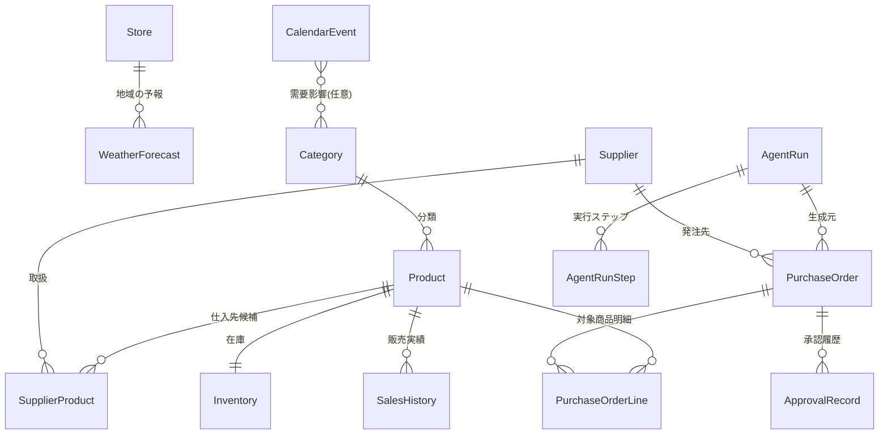

# 自動発注エージェント デモ — 仕様ドラフト v0.5

> ステータス: **Fix（残論点も確定済み・実装プラン作成可）**
> 作成日: 2026-06-24 ／ 更新: 2026-06-24
> 更新履歴: v0.2（MudBlazor・Dapper・発注/入荷シミュレーション・仮想時計・メトリクス設計・Agent Framework機能マッピング）／ v0.3（Aspire採用・承認ポリシー確定・チャット発注限定・テストプロジェクト追加）／ v0.4（レビュー反映: HITL実装モデル確定・販売シミュレーション/ローリング生成追加・入荷待ちの正をPOに統一・SQLite取扱方針・処理フロー図更新）／ v0.5（残論点確定: MVP範囲・任意AF機能4つ採用・Aspire構成・発注数量はツール補助＋LLM判断）
> 次工程: 実行プラン作成 → 実装

---

## 1. 目的・コンセプト

小売業（**食品スーパーマーケット** を題材に確定）における **AIエージェントによる自動発注** のデモアプリケーションを構築する。

> **業態の選定理由**: 食品スーパーは「①常温・飲料・乾物などの**定番品**（日持ち・リードタイム長＝自動承認向き）」と「②生鮮・日配・惣菜などの**短サイクル品**（賞味期限短・需要変動大・廃棄リスク＝承認必須向き）」を併せ持ち、本デモの主題である**承認要否の出し分け**と**天候・イベント感応の需要予測**を自然に表現できるため。

エージェントが在庫・販売実績・天気・イベント等の情報をツール経由で収集し、需要を予測したうえで **発注提案** を生成する。担当者は自然言語でエージェントに指示でき、最終的な発注は **人間の承認（Human-in-the-Loop）** を経て確定する。

「エージェントを使う」ことの具体像を示すことが主目的であり、業務システムとしての完成度よりも、**エージェントの自律的な情報収集・推論・ツール実行・承認フロー** を分かりやすく可視化することを重視する。

### デモの目的（2つ）
1. **エージェントアプリケーションのイメージ獲得** — 「AIエージェントを使ったアプリとは具体的にどんなものか」を、画面・処理フロー・データを通じて体感できるようにする。
2. **Microsoft Agent Framework の使用方法の確認** — フレームワークの主要機能（エージェント生成、関数ツール、ストリーミング、承認必須ツール、ミドルウェア、可観測性等）を実際にどう使うかを、実装で確認できるようにする（→ 各機能の利用方法は **§4.6 Agent Framework 機能の利用マッピング** に集約）。

### デモで見せたい価値
- 自然言語の指示だけで、複数データソースを横断した発注判断ができる
- エージェントの「思考過程」と「ツール呼び出し」が画面上で可視化される
- 発注という不可逆操作に対して、承認ゲート（HITL）が機能する
- Agent Framework の代表的な機能の使い方が、動くコードとして残る

---

## 2. 想定ユーザーと利用シーン

| ペルソナ | 役割 | 主な操作 |
|---|---|---|
| 発注担当者（店長／バックヤード担当） | 在庫を見て発注を判断する | エージェントへの指示、提案の承認／却下／数量調整 |
| （将来）本部バイヤー | 複数店舗の発注方針を設定 | 発注ルール・閾値の設定 |

### 2.1 基本の利用イメージ（1日の流れ）

> **「担当者がWebブラウザでアプリを開き、ダッシュボードで状況を見て、必要なら承認する」** という使い方が中心。エージェントはバックグラウンド（定期処理）でも、担当者の指示（チャット）でも動く。

```
朝、出勤 → ブラウザでアプリを開く
  └ ダッシュボード(画面1)を見る
       ├ 夜間の日次バッチが作った「承認待ち提案」が3件ある
       ├ 自動承認で確定済みの発注が5件（事後確認だけでOK）
       └ 過少在庫アラートが2件
  ↓
承認待ちを処理 → 承認画面(画面3)へ
  └ 提案明細と根拠を確認し、数量調整して承認 or 却下
  ↓
追加で気になる点 → チャット(画面2)でエージェントに相談
  └「週末の花火大会に備えて飲料を増やして」など自然言語で指示
  ↓
結果を確認 → 履歴(画面4) / ダッシュボードでアラート解消を確認
```

### 2.2 ユースケース一覧

| ID | ユースケース | アクター | 使う画面 | 概要 | 承認 |
|---|---|---|---|---|---|
| **UC-1** | ダッシュボードで状況把握 | 発注担当者 | 画面1 | ログイン後、在庫アラート・承認待ち件数・自動承認済み・最近の発注を一覧で確認 | — |
| **UC-2** | チャットで発注を相談・指示 | 発注担当者 | 画面2 | 自然言語で指示し、エージェントの情報収集→推論→提案をストリーミングで見る | — |
| **UC-3** | 発注提案を承認／却下／調整 | 発注担当者 | 画面3 | 承認待ち提案の明細・根拠を確認し、数量を編集して承認、または却下（コメント付き） | **必要** |
| **UC-4** | 自動承認された発注を事後確認 | 発注担当者 | 画面1/4 | ポリシーで自動確定した発注を「自動承認」フラグ付きで確認（操作不要、監査目的） | 不要 |
| **UC-5** | 定期処理の結果を受け取る | （システム）→担当者 | 画面1 | 夜間/早朝の日次バッチが自動で提案を生成。担当者は翌朝ダッシュボードで結果を受け取る | ポリシー次第 |
| **UC-6** | 発注履歴・エージェント実行ログの確認 | 発注担当者 | 画面4 | 確定発注のステータス・入荷予定、及びエージェントがどのツールを呼び何を根拠にしたかを追跡 | — |
| **UC-7** | 発注ルール・閾値の設定 | 発注担当者／本部 | 画面6 | 自動承認の上限金額・数量倍率・承認期限・常時承認カテゴリ等を変更 | — |
| **UC-8** | 在庫・商品マスタの参照 | 発注担当者 | 画面5 | 商品の現在庫・安全在庫・仕入先・リードタイムを確認 | — |

> **承認は誰がどこで？** → 発注担当者が **Web画面（画面3）** で行う。エージェントは承認必須の発注を「承認待ち」として登録するだけで、自分では確定できない（HITL）。一方、ポリシー条件を満たす定番品の補充は自動承認され、担当者は事後確認のみ（UC-4）。

### 2.3 代表シナリオ（UC-2 + UC-3 の例）
1. 担当者がチャット(画面2)で「**明日から週末にかけて気温が上がるみたい。飲料とアイスの発注を見直して**」と入力。
2. エージェントが在庫・直近の販売実績・天気予報を取得し、需要増を予測（ツール呼び出しが画面に流れる）。
3. 該当商品の発注提案（商品・数量・仕入先・概算金額・根拠）を生成し、承認画面(画面3)に「承認待ち」として登録。
4. 担当者が提案画面で内容と根拠を確認し、数量を微調整して承認。
5. 発注が確定（`Ordered`＝入荷待ち）し、入荷予定日が設定される。後日（仮想時間）の入荷で在庫が回復し、ダッシュボードのアラートが解消（→ §3.6）。

---

## 3. 機能要件

### 3.1 画面構成（Blazor Server + MudBlazor）

**UIデザイン方針**（`usausa/Study-AWS` の CloudManager を参考）:
- **MudBlazor** を使用したマテリアルデザインの管理画面。
- **左サイドに固定のメニューバー（`MudDrawer` + `MudNavMenu`）**、上部に `MudAppBar`、本体右側がコンテンツ領域。
- **無駄な空白を抑えたコンパクト表示** … `MudTable`/`MudDataGrid` は `Dense="true"`、余白・パディングは最小限、情報密度を高くする。
- 一覧は `MudTable`/`MudDataGrid`、サマリは `MudCard`、アラートは `MudAlert`、状態表示は `MudChip`、進捗は `MudProgress` を基本とする。
- **UI言語は日本語のみ**（多言語化は行わない）。

**左メニュー（ナビゲーション項目）**: ダッシュボード / エージェント / 承認待ち / 発注履歴 / 在庫・商品 / 設定（＋デモ操作: 仮想時計・再シード）。

| # | 画面 | 概要 | 主なユーザー入力 |
|---|---|---|---|
| 1 | **ダッシュボード** | 在庫状況サマリ、欠品・過少在庫アラート、承認待ち件数、**期限切れ件数**、自動承認済み、入荷予定、最近の発注 | 各画面への遷移 |
| 2 | **エージェント・コンソール（チャット）** | 自然言語でエージェントに指示。応答はストリーミング表示。ツール呼び出し・思考過程をインライン可視化 | 指示テキスト入力、送信 |
| 3 | **発注提案レビュー／承認** | エージェント生成の提案明細（商品・数量・仕入先・単価・金額・根拠）を一覧表示。HITL承認の中心画面。**残り承認期限を表示** | 承認 / 却下 / 数量編集 / コメント |
| 4 | **発注履歴** | 発注の一覧・詳細（ステータス＝発注中/入荷済/却下/期限切れ、入荷予定日）。エージェント実行ログへの導線 | フィルタ・検索 |
| 5 | **商品・在庫マスタ** | 商品一覧、現在庫、安全在庫、仕入先、リードタイム、入荷待ち数 | （閲覧中心、編集は任意） |
| 6 | **設定／デモ操作** | 発注ルール（安全在庫、自動承認上限、対象カテゴリ等）、**仮想時計の操作（時短モード）**、DB再シード | 閾値・ルール編集、仮想時計操作 |

> デモ最小構成（MVP）では **画面2（チャット）＋画面3（承認）＋画面1（ダッシュボード）** を中核とし、4〜6は段階的に追加。共通レイアウト（左メニュー・AppBar）はMVPから用意する。

### 3.2 エージェントの処理フロー

```
[トリガー]
  ├─ 手動: チャットでの自然言語指示
  └─ スケジュール: 定刻バッチ（→ 3.4 定期処理）
        ↓
[情報収集] エージェントがツールを自律的に呼び出し
  ├─ 現在庫・入荷待ちの取得
  ├─ 販売実績の取得（直近N日）
  ├─ 天気予報の取得（モック）
  ├─ イベント・販促カレンダーの取得
  └─ 仕入先カタログ（価格・最小発注単位MOQ・リードタイム）
        ↓
[推論] 需要予測 → 発注要否・推奨数量を算出（根拠つき）
        ↓
[提案生成] CreateOrderDraft で発注ドラフト(明細)を作成
        ↓
[承認ポリシー評価(3.3)]
  ├─ 自動承認の条件を満たす ──→ そのまま確定（AutoApproved → Ordered）
  └─ 承認必須 ──→ 承認待ちキューへ（PendingApproval）
                     ↓
              [承認ゲート] 担当者が承認画面(画面3)で 承認/却下/数量調整
                ・チャット起点では ApprovalRequiredAIFunction による
                  Framework標準の承認要求としても提示（3.3.1）
                     ↓ 承認
[確定] PurchaseOrder.Status = Ordered（入荷待ち）／入荷予定日を設定（3.6）
        ↓ （仮想時間が進む・入荷シミュレーション）
[入荷] 予定日到達で在庫を増やし Received（3.6）
```

### 3.3 承認の要否パターン（Human-in-the-Loop 制御）

発注は不可逆操作のため、**承認ポリシー** で「人間の承認が必要なパターン／不要なパターン」を切り分ける。エージェントは `PlaceOrder` 実行前にポリシーを評価し、必要時のみ承認画面へエスカレーションする。

| パターン | 承認 | 条件の例 |
|---|---|---|
| **自動承認（承認不要）** | 不要 | 定番品の補充、かつ ①発注金額が閾値以下（例: 5万円未満）②数量が安全在庫補充の範囲内 ③過去の発注パターンから逸脱しない、をすべて満たす |
| **承認必須** | 必要 | 金額が閾値超／新規・休眠商品の発注／通常発注数量を大きく超える（例: 平均の2倍超）／在庫過多リスクがある／仕入先のMOQ・リードタイム逸脱 |
| **常時承認必須（強制）** | 必要 | カテゴリ設定で「常に承認」に指定された商品（生鮮・高単価・季節品など） |

- 自動承認の上限金額・数量倍率・対象カテゴリは **設定画面（画面6）** で調整可能とする。
- 自動承認された発注も **履歴に「自動承認」フラグつきで記録** し、事後確認できるようにする（監査性とデモでの対比のため）。

#### 3.3.1 HITL の実装モデル（確定）

承認の実体は **承認待ちキュー（`PurchaseOrder.Status = PendingApproval`）** とし、**チャット起点・バッチ起点の両方で共通**に扱う。これにより「対話ユーザーがいないバッチで実行が中断・再開できない」問題を回避する。

| 起点 | 提案生成 | 承認の流れ |
|---|---|---|
| **バッチ（6:00 等）** | エージェントが `CreateOrderDraft` で発注ドラフトを作成 → 承認ポリシー評価 | 自動承認可なら即 `Ordered`。承認必須なら `PendingApproval` として**キューに積むだけ**（エージェント実行は中断せず完了）。担当者が後で画面3で承認 → アプリ側ドメインサービスが `Ordered` に確定 |
| **チャット（対話）** | 同上（`CreateOrderDraft`） | 承認必須分は同じく画面3のキューへ。**加えて**、ユーザーがチャット内で即時に発注確定を指示した場合は、`PlaceOrder` を **`ApprovalRequiredAIFunction`** として実装し、**Framework標準の承認要求**を提示（＝Agent Framework の HITL 機能のデモ）。承認すると同じドメインサービスで `Ordered` に確定 |

- **正となる承認窓口は画面3のキュー**。`ApprovalRequiredAIFunction` は「チャット内での即時承認体験」と「フレームワーク機能の実演」を担う補助的経路で、**最終的な確定処理（在庫・PO更新）は両経路とも同一のドメインサービスに集約**する（分岐の二重実装を避ける）。
- バッチではエージェント実行を中断しないため、`AgentRun.Status` に「承認待ち中断」状態は不要（`Running/Completed/Failed` のまま）。
- これにより、**承認の永続化・再開の複雑さを持ち込まずに**、Framework の承認ツール機能も demonstrateできる。

#### 承認が放置された場合の挙動（重要なデモポイント）
承認待ち提案を担当者が処理しなかった場合に何が起きるかを、明示的に見せる。

| 状態 | 挙動 |
|---|---|
| 承認待ち（期限内） | 画面3に「残り承認期限（仮想時間ベース）」をカウントダウン表示。期限が近い提案は `MudChip` で警告色 |
| **期限切れ（放置された）** | 承認期限（既定: 仮想24h）を過ぎると、クリーンアップ処理が自動で **`Expired`（期限切れ）** に遷移。発注は実行されず、`ApprovalRecord` に `Action=Expired` を記録 |
| 期限切れの可視化 | ダッシュボードに「期限切れ N件」を表示し、履歴(画面4)で期限切れ提案を一覧できる。**「放置すると発注されず失効する」** ことが分かる |
| 失効後の影響 | 発注されなかったため在庫は補充されず、過少在庫アラートが残る（＝放置の結果が在庫に表れる） |

> これにより「承認を放置するとどうなるか（＝自動で却下され、在庫不足が解消されないまま残る）」がデモ上で体感できる。

### 3.4 定期処理（スケジュール実行）

手動チャットに加え、**定刻バッチ** でエージェントを自律起動するパターンを用意する（デモで「無人でも回る」ことを示す）。

| 処理 | タイミング | 内容 |
|---|---|---|
| **日次 販売シミュレーション** | **毎日 0:00（仮想時間）** | 前日ぶんの販売を擬似発生させ、需要分だけ `Inventory.OnHandQty` を**減算**し `SalesHistory` に追記（→ 3.6.1）。これが在庫減を生み、発注ループを継続させる |
| **日次 発注チェック** | **毎日 6:00（仮想時間）** | 全対象商品について在庫・販売実績・天気を評価し、過少在庫を検知したら発注提案を生成。承認ポリシーに従い自動承認 or 承認キュー登録 |
| **ローリング生成（天気・予定）** | 日次 | 仮想現在日を基準に、天気予報・イベントの**先N日ぶんを常に補充**（地平線を追い越さないようにする → 3.6.1） |
| **承認期限切れクリーンアップ** | 一定周期（仮想時間で1h毎） | 承認期限を過ぎた提案を `Expired` に遷移（→ 3.3 承認放置の挙動） |
| **入荷シミュレーション** | 一定周期（仮想時間で1h毎） | 入荷予定日に達した発注を入荷処理し在庫を増やす（→ 3.6） |
| **（任意）週次 需要レビュー** | 週1回（仮想時間） | 翌週の天気・イベントを踏まえた先行発注の提案 |

- 実装方式: **`BackgroundService`** によるスケジューラ。Blazor Server と同一プロセスでホストし、**仮想時計（→ 3.7）** を時刻源とする。
- 日次バッチの実行時刻は **6:00 固定**（仮想時間の毎日6:00）。販売シミュレーションは日付変わり（0:00）に先行実行し、6:00 の発注チェックが「減った在庫」を見て提案できるようにする。
- バッチ起動時もエージェントの実行ログ（ツール呼び出し・推論）を記録し、ダッシュボード／履歴から事後確認できる。
- 時短モードにより、現実の1時間で仮想1日が進むため、デモ中に複数回の販売減→発注→入荷→期限切れが自然に発生する（→ 3.7）。

### 3.5 エージェントのツール（AIFunction）

| ツール | 種別 | 説明 |
|---|---|---|
| `GetInventory` | 読み取り | 商品の現在庫・安全在庫・入荷待ち数を返す |
| `GetSalesHistory` | 読み取り | 指定期間・商品の販売実績を返す |
| `GetWeatherForecast` | 読み取り | 店舗地域の天気予報（モックAPI） |
| `GetEventCalendar` | 読み取り | 地域イベント・店舗販促予定 |
| `GetSupplierCatalog` | 読み取り | 仕入先・単価・MOQ・リードタイム |
| `GetCurrentDate` | 読み取り | **仮想時計** の現在日時（エージェントが「今日」を正しく認識するため） |
| `CalculateReorderSuggestion` | 読み取り（計算補助） | 発注点・安全在庫・入荷待ち・直近実績から**推奨発注数量を算出**して返す。エージェントは根拠を見て最終調整（数量決定は「ツール補助＋LLM判断」方針） |
| `CreateOrderDraft` | 書き込み（提案） | 発注ドラフトを生成（承認待ちキューに登録） |
| `PlaceOrder` | **承認必須** | 発注を確定。承認後に「発注中（入荷待ち）」レコードを作成（→ 3.6） |

### 3.6 発注・入荷シミュレーション

実発注は行わず、**発注〜入荷を時間経過でシミュレートする**。発注確定後すぐ在庫が増えるのではなく、仕入先のリードタイム分待ってから入荷する流れを再現する。

```
[発注確定(PlaceOrder)]
   └ PurchaseOrder.Status = Ordered（発注中／入荷待ち）
     ExpectedDeliveryDate = 現在(仮想日) + LeadTimeDays を設定
        ↓  （仮想時間が進む）
[入荷シミュレーション（定期処理 3.4）]
   └ 仮想「現在日」>= ExpectedDeliveryDate の発注を検出
        ↓
[入荷処理]
   ├ Inventory.OnHandQty += 発注数量
   ├ Inventory.IncomingQty -= 発注数量
   ├ PurchaseOrder.Status = Received（入荷済）
   └ 入荷イベントを記録（履歴・ダッシュボードに反映）
```

- 「発注中（入荷待ち）」は専用の状態として明示し、画面5/4で **入荷待ち数** と **入荷予定日** を表示する。
- 発注直後は `OnHandQty` は増えず、入荷予定日到達で `OnHandQty` に加算される。
- **入荷待ち数の正（source of truth）は `PurchaseOrder`（Status=Ordered）** とする。`Inventory.IncomingQty` は未入荷POからの**導出値（集計キャッシュ）**と位置づけ、入荷/発注時に必ず再計算して二重管理のズレを防ぐ。
- これにより「発注しても即時には在庫が回復しない（リードタイムがある）」という現実的な挙動と、エージェントが入荷待ちを考慮して二重発注を避ける判断を見せられる。
- 実装は EF Core を使わず **Dapper によるデータアクセス層**（→ §4 / §5）で行う。

### 3.6.1 販売シミュレーションとローリング生成

発注ループを継続させるため、在庫を**減らす仕組み**と、仮想時間の進行に追従して将来データを**補充する仕組み**を持つ（→ §3.4 の日次処理）。

- **販売シミュレーション（在庫減）**: 仮想日が変わるごとに、各商品の基準需要を **曜日・天候（その日の `WeatherForecast`）・イベント** で補正した数量だけ販売が発生したものとし、`OnHandQty` を減算（0未満にはせず欠品扱い）。同時に当日の `SalesHistory` を追記する。これにより過少在庫が再発し、6:00 の発注チェックが意味を持つ。
- **ローリング生成**: シードは固定期間ぶんしか持たないため、仮想現在日が進むと天気/イベントの地平線を追い越す。日次で **「仮想現在日＋先N日（例: 14日）」までを常に満たすよう** 天気予報・イベントを追加生成する。販売実績も「当日ぶん」を毎日積み増すことで、エージェントが参照する直近実績が常に最新になる。
- これらにより、デモを長時間動かしても **在庫減→発注→入荷→また減** の循環と、エージェントが見るデータの鮮度が保たれる。生成は決定論的（仮想日をシードに含める）にして再現性を確保。

### 3.7 時短モード（仮想時計）

デモ中に「日次バッチ・入荷・承認期限切れ」を待たずに観察できるよう、**時間を圧縮する仮想時計** を導入する。

- **方式**: 現実の経過時間を倍率で拡大し、仮想時刻を算出する。
  - 既定の **時短モード**: 現実の **1時間 = 仮想1日**（＝24倍）。
  - 算出式: `仮想日時 = 仮想起点 + (現実経過時間 × 倍率)`。
  - 実装イメージ: 「仮想起点（VirtualEpoch）」と「起点からの現実経過時間」を保持し、**起点からの経過時間を日数オフセットに換算** して現在仮想日を求める `IClock`（`VirtualClock`）を用意。
- **適用範囲**: バッチのスケジュール判定、入荷予定日の到達判定、承認期限の判定、エージェントの `GetCurrentDate`、画面の日付表示 — **すべて仮想時計を参照**（`DateTime.Now` を直接使わない）。
- **操作（画面6 デモ操作）**:
  - 倍率の切替（等速 / 24倍 / 任意倍率）、一時停止・再開。
  - 「仮想時間を○時間進める」ボタン（手動スキップ）で、待たずに翌日のバッチや入荷を発生させる。
- これにより、短いデモ時間内で「発注→入荷で在庫回復」「承認放置→期限切れ」「翌朝6:00の自動発注」を繰り返し観察できる。

### 3.8 チャットのスコープ（発注関連限定）

エージェント・コンソール（画面2）の対話は **発注業務に関連する話題に限定** する。

- 応答する範囲: 在庫・販売実績・天気/イベントに基づく需要予測、発注の提案・調整・相談、発注状況/入荷予定の確認 など。
- 範囲外（一般雑談・無関係な依頼・他業務）は、**システムプロンプトのガードレール** でやんわり断り、発注関連の用途へ誘導する。
- ツールも発注ドメインのもの（§3.5）のみ提供し、業務外の操作はできない構成とする。

> `PlaceOrder` は承認ポリシー（3.3）に従い、承認必須ケースのみ **`ApprovalRequiredAIFunction`** の承認イベントをBlazor承認画面に連携する。自動承認ケースはそのまま実行する。

---

## 4. 技術仕様

### 4.1 基本スタック
- **.NET 10 / C#**
- **UI: Blazor Server**（リアルタイム表示・ストリーミングに適合、サーバー側でエージェントを実行）
- **LLM: Microsoft Foundry（クラウド / Azure AI Foundry）** … `IChatClient` 経由で接続。エンドポイント・モデル・認証情報は設定で注入

### 4.2 Microsoft Agent Framework（2026/04 に 1.0 GA）
- **`Microsoft.Agents.AI`** — エージェント中核（`AIAgent` / `ChatClientAgent`、ストリーミング `RunStreamingAsync`、セッション、ツール、ミドルウェア、OpenTelemetry）
- **`Microsoft.Extensions.AI`** — `IChatClient` 抽象（プロバイダ非依存）
- Foundry 接続用コネクタ（Azure AI Foundry 系。`Azure.AI.OpenAI` / `Microsoft.Extensions.AI.*` 等。**具体的なパッケージ名・バージョンは実装時にNuGetで確定**）
- ツールは `AIFunctionFactory.Create(...)` で関数登録、承認は `ApprovalRequiredAIFunction`
- **使用モデル: `gpt-5.4-mini`**（Azure AI Foundry にデプロイ）

> 参考実装: `usausa/pc-agent`（同じ Microsoft.Agents.AI を使用。`AsAIAgent`／`RunStreamingAsync`／`AIFunctionFactory.Create`／`ApprovalRequiredAIFunction` の利用パターンを踏襲）

#### データアクセス
- **ORM は使用せず Dapper を採用**（`Dapper` + `Microsoft.Data.Sqlite`）。
- **Dapper の利用はデータアクセス層（`AutoOrderAgent.Data`）に閉じる**。上位層（Domain/Agent/Web）はリポジトリインターフェース経由でアクセスし、SQL・`IDbConnection`・Dapper 依存を漏らさない。

### 4.3 アーキテクチャ（レイヤ構成案）

```
AutoOrderAgent.sln
├─ src/
│  ├─ AutoOrderAgent.Web         … Blazor Server + MudBlazor（UI・左メニュー・承認）
│  ├─ AutoOrderAgent.Agent       … エージェント構成、ツール定義、IChatClient(Foundry)設定
│  ├─ AutoOrderAgent.Domain      … モデル・サービス・リポジトリ interface・仮想時計(IClock)
│  ├─ AutoOrderAgent.Data        … Dapper リポジトリ実装・SQL・DB初期化/シード（Dapperはここに閉じる）
│  ├─ AutoOrderAgent.ServiceDefaults … Aspire 既定（OpenTelemetry・ヘルスチェック共通化）
│  └─ AutoOrderAgent.AppHost     … .NET Aspire（Web/バッチをオーケストレーション、OTLP集約 → §4.7）
└─ tests/
   ├─ AutoOrderAgent.Domain.Tests … ドメインロジック単体テスト（承認ポリシー・仮想時計・需要計算）
   ├─ AutoOrderAgent.Data.Tests   … Dapper リポジトリ統合テスト（SQLite に対する実行）
   └─ AutoOrderAgent.Agent.Tests  … ツール（AIFunction）・エージェント周辺の単体テスト（IChatClient はモック）
```

### 4.4 データ（モック / SQLite ファイルベース・Dapper）
- **SQLite のファイルベースDB**（例: `autoorder.db`）。`Microsoft.Data.Sqlite` + **Dapper** でアクセス（EF Core は使わない）。
- **初回起動時に DB を自動構築＋シード**: 起動時に DDL（`schema.sql`）でテーブルを作成し、データが空なら `DbSeeder`（Dapper）でサンプルデータを投入。
- スキーマのマイグレーションは SQL スクリプト管理（簡易。デモのため再シード可）。
- 投入内容の概要（詳細は §5 DB設計を参照）:
  - 商品マスタ … 常温/飲料/冷蔵/冷凍/惣菜の各カテゴリで計 **40品目**
  - 在庫 … 現在庫・入荷予定（一部を過少在庫状態にしてデモ初期にアラートが出るよう調整）
  - 販売実績 … 過去90日、曜日・天候・イベントによる変動を擬似生成
  - 仕入先カタログ … 単価・MOQ・リードタイム
  - 天気予報・イベント … 向こう7〜14日分のモック（猛暑・連休などデモ映えする条件を仕込む）

### 4.5 仮想時計（時短モード）の実装
- `IClock` 抽象を `Domain` に置き、`VirtualClock` が「仮想起点＋（現実経過×倍率）」で現在仮想日時を算出（→ §3.7）。
- DI でシングルトン登録し、**バッチ・入荷シミュレーション・承認期限・エージェント・UI日付** はすべて `IClock` を参照（`DateTime.Now` 直接参照を禁止）。
- 倍率・一時停止・手動スキップは状態としてメモリ保持（デモ用、永続化は任意）。

### 4.6 Agent Framework 機能の利用マッピング

「フレームワークのどの機能を、本デモのどこで、どう使うか」を一覧化する（デモ目的②の達成確認用）。

| Agent Framework の機能 | 使用するAPI（目安） | 本デモでの利用箇所 |
|---|---|---|
| エージェント生成 | `ChatClientAgent` / `AsAIAgent` | Foundry の `IChatClient` をラップして発注エージェントを構成 |
| LLM接続（プロバイダ非依存） | `Microsoft.Extensions.AI.IChatClient` | Azure AI Foundry（`gpt-5.4-mini`）への接続 |
| 関数ツール | `AIFunctionFactory.Create(...)` | §3.5 の各ツール（在庫・販売・天気・イベント・仕入先・日付取得・発注） |
| ストリーミング応答 | `RunStreamingAsync` | チャット画面(画面2)でトークン逐次表示 |
| ツール呼び出しの可視化 | ストリーム/関数呼び出しイベント | ツール名・入力・出力を画面2にインライン表示、`AgentRunStep` に記録 |
| **承認必須ツール（HITL）** | `ApprovalRequiredAIFunction` | `PlaceOrder` の承認ゲート → 承認画面(画面3)に連携 |
| 会話セッション/履歴 | スレッド/セッション機能 | チャットの会話継続、実行を `AgentRun` として記録 |
| ミドルウェア（採用） | 関数/エージェントミドルウェア | ロギング・メトリクス計測（§4.7）・例外ハンドリングの横断挿入 |
| 可観測性/OpenTelemetry（採用） | フレームワーク内蔵の計装 | エージェント実行・ツール・LLM呼び出しのメトリクス/トレース（§4.7） |
| 会話セッション履歴（採用） | スレッド/セッション機能 | チャットの会話継続、実行を `AgentRun` として記録 |
| 構造化出力（採用） | スキーマ指定の応答 | 発注提案を型付き構造で受け取り、明細に確実に変換 |

> **任意機能は上記4つをすべて採用**（§8.4 確定）。必須機能（エージェント生成・関数ツール・ストリーミング・承認必須ツール）と合わせ、Agent Framework の主要機能を一通り demonstrate する。

### 4.7 可観測性とメトリクス設計（Aspire 採用）

**Aspire を採用する**。下記メトリクスを `System.Diagnostics.Metrics`（Meter）/ OpenTelemetry で発行し、`AppHost`（Aspire）経由で OTLP 集約・ダッシュボード可視化する。Agent Framework 内蔵の OpenTelemetry 計装（エージェント/ツール/LLM）と合わせて、業務メトリクスも併せて確認できるようにする。

**エージェント/LLM 系**
- `agent.runs.count`（トリガー種別=Chat/Batch別のラベル）
- `agent.run.duration`（実行時間のヒストグラム）
- `agent.tool.calls.count`（ツール名別）
- `agent.tool.duration`（ツール別レイテンシ）
- `llm.requests.count` / `llm.request.duration`
- `llm.tokens`（prompt/completion、可能なら）

**業務/発注 系**
- `orders.proposed.count`（提案件数）
- `orders.autoapproved.count` / `orders.manualapproved.count` / `orders.rejected.count`
- `orders.expired.count`（承認放置による失効。放置の可視化に有用）
- `approval.latency`（提案生成→承認までの所要時間、仮想時間）
- `orders.received.count`（入荷シミュレーションでの入荷件数）
- `inventory.stockout.count`（過少在庫アラート件数のゲージ）

**構成**: `AppHost` を追加し、Web/バッチを Aspire オーケストレーションに載せ、OTLP でメトリクス・トレースを集約。`ServiceDefaults`（Aspire 既定）で OpenTelemetry・ヘルスチェックを共通化する。

### 4.8 テスト方針

`tests/` 配下にテストプロジェクトを用意する（→ §4.3）。**テストフレームワークは xUnit、アサーションは `Shouldly`、モックは `NSubstitute`** を基本とする（実装プランで最終確定）。

| テストプロジェクト | 対象 | 主なテスト内容 |
|---|---|---|
| `AutoOrderAgent.Domain.Tests` | ドメインロジック（外部依存なし） | **承認ポリシー判定**（自動承認/承認必須/常時承認の分岐）、**仮想時計**（経過時間→仮想日への換算、6:00判定）、需要予測の簡易ロジック、発注数量計算（MOQ/ケース丸め） |
| `AutoOrderAgent.Data.Tests` | Dapper リポジトリ | 実 SQLite（一時ファイル or `:memory:`）に `schema.sql` を適用し、CRUD・状態遷移（Ordered→Received）・期限切れ抽出・在庫更新を検証 |
| `AutoOrderAgent.Agent.Tests` | ツール・エージェント周辺 | 各 `AIFunction` の入出力、承認必須ツールの分岐、システムプロンプトのガードレール方針。**`IChatClient` はモック**し LLM 非依存で検証 |

- **対象の優先**: 不可逆操作と分岐ロジック（承認ポリシー・在庫/発注の状態遷移・仮想時計・入荷シミュレーション）を重点的にカバー。
- **LLM 非依存**: エージェントのテストは `IChatClient` をスタブ化し、決定論的に実行。実 Foundry への通信はテストに含めない。
- **CI 実行**: `dotnet test` で全テストを実行可能にする（外部サービス・APIキー不要で完結）。

---

## 5. データベース設計（SQLite ファイルベース）

**Dapper + Microsoft.Data.Sqlite** を前提とした論理設計（EF Core は不使用）。テーブルは DDL（`schema.sql`）で定義し、Dapper のリポジトリでアクセスする。SQLite の型（`INTEGER`/`TEXT`/`REAL`/`NUMERIC`）で記載するが、C# 側は適切な型（`decimal`/`DateOnly`/`enum` 等）にマッピングする（Dapper のカスタムハンドラ or 変換で対応）。enum は `TEXT`（名称）で保存。**日時はすべて仮想時計（§3.7）基準の値を保存**する。

**SQLite 取り扱いの方針（実装上の注意）**
- **金額は浮動小数を避ける**: SQLite の `NUMERIC`/`REAL` 親和性による誤差を避けるため、金額は **整数（最小通貨単位＝円）で保存**し、C# 側 `decimal`/`int` にマップする（表中 `NUMERIC` 表記の金額列はこの方針）。
- **日付/日時**: ISO 8601 文字列（`TEXT`）で保存し、Dapper の型ハンドラで `DateOnly`/`DateTimeOffset` に変換。
- **並行性**: Blazor Server と複数 `BackgroundService` が同一DBファイルへアクセスするため、**WAL モードを有効化**し、書き込みは**リポジトリ層で直列化**（SQLite は単一ライタ）。接続は短命に開閉する。

### 5.1 ER 概要



### 5.2 マスタ系テーブル

#### Store（店舗）※デモは単一店舗
| 列 | 型 | 説明 |
|---|---|---|
| Id | INTEGER PK | |
| Name | TEXT | 店舗名 |
| RegionCode | TEXT | 天気予報の地域キー |
| Prefecture | TEXT | 都道府県 |

#### Category（商品カテゴリ）
| 列 | 型 | 説明 |
|---|---|---|
| Id | INTEGER PK | |
| Code | TEXT UQ | カテゴリコード |
| Name | TEXT | 例: 飲料 / 乾物 / 生鮮 / 日配 / 惣菜 |
| StorageType | TEXT(enum) | `Ambient`/`Chilled`/`Frozen` |
| RequiresApprovalAlways | INTEGER(bool) | 常時承認必須カテゴリ（生鮮・惣菜など） |

#### Supplier（仕入先）
| 列 | 型 | 説明 |
|---|---|---|
| Id | INTEGER PK | |
| Code | TEXT UQ | 仕入先コード |
| Name | TEXT | 仕入先名 |
| OrderCutoffTime | TEXT | 発注締め時刻（例 "11:00"） |
| IsActive | INTEGER(bool) | 有効フラグ |

#### Product（商品マスタ）
| 列 | 型 | 説明 |
|---|---|---|
| Id | INTEGER PK | |
| Code | TEXT UQ | JAN 等 |
| Name | TEXT | 商品名 |
| CategoryId | INTEGER FK→Category | |
| OrderUnit | TEXT | 発注単位（ケース/本/個） |
| CaseQty | INTEGER | ケース入数（発注ロット） |
| SellingPrice | NUMERIC | 売価（参考） |
| SafetyStock | INTEGER | 安全在庫 |
| ReorderPoint | INTEGER | 発注点 |
| ShelfLifeDays | INTEGER | 日持ち日数（短いほど承認寄り） |
| IsWeatherSensitive | INTEGER(bool) | 天候感応フラグ |
| IsActive | INTEGER(bool) | 取扱中フラグ |

#### SupplierProduct（仕入先カタログ：商品×仕入先）
| 列 | 型 | 説明 |
|---|---|---|
| Id | INTEGER PK | |
| ProductId | INTEGER FK→Product | |
| SupplierId | INTEGER FK→Supplier | |
| PurchasePrice | NUMERIC | 仕入単価 |
| MinOrderQty | INTEGER | 最小発注数量（MOQ） |
| LeadTimeDays | INTEGER | リードタイム |
| IsPreferred | INTEGER(bool) | 主仕入先 |

> 一意制約: `(ProductId, SupplierId)`

### 5.3 在庫・実績・外部要因テーブル

#### Inventory（在庫スナップショット：商品1対1）
| 列 | 型 | 説明 |
|---|---|---|
| Id | INTEGER PK | |
| ProductId | INTEGER FK→Product UQ | |
| OnHandQty | INTEGER | 現在庫（販売シミュレーションで減算／入荷で加算） |
| IncomingQty | INTEGER | 入荷予定数（**導出値**: 未入荷PO=Status=Ordered の合計を再計算してキャッシュ。正は PurchaseOrder。§3.6） |
| NextDeliveryDate | TEXT(date) | 直近入荷予定日（未入荷POから導出） |
| UpdatedAt | TEXT(datetime) | 更新日時（仮想時計基準） |

#### SalesHistory（日次販売実績：商品×日）
| 列 | 型 | 説明 |
|---|---|---|
| Id | INTEGER PK | |
| ProductId | INTEGER FK→Product | |
| Date | TEXT(date) | 販売日 |
| QuantitySold | INTEGER | 販売数 |
| WeatherCondition | TEXT(enum) | 当日の天候（店舗単位の値を行へ非正規化。参照簡略化のため） |
| TemperatureHigh | REAL | 当日最高気温（同上） |

> 一意制約: `(ProductId, Date)`。約40品目×90日 ≒ 3,600行（初期）。販売シミュレーションで仮想日ごとに当日ぶんが追記される（§3.6.1）。

#### WeatherForecast（天気予報モック：地域×日）
| 列 | 型 | 説明 |
|---|---|---|
| Id | INTEGER PK | |
| RegionCode | TEXT | 地域キー |
| Date | TEXT(date) | 対象日 |
| Condition | TEXT(enum) | `Sunny`/`Cloudy`/`Rainy`/`Snowy` |
| TemperatureHigh | REAL | 最高気温 |
| TemperatureLow | REAL | 最低気温 |
| PrecipitationProbability | INTEGER | 降水確率(%) |

#### CalendarEvent（イベント・販促カレンダー）
| 列 | 型 | 説明 |
|---|---|---|
| Id | INTEGER PK | |
| Name | TEXT | 例: 三連休 / 花火大会 / 特売 |
| Type | TEXT(enum) | `Holiday`/`LocalEvent`/`Promotion` |
| StartDate / EndDate | TEXT(date) | 期間 |
| ImpactLevel | TEXT(enum) | `High`/`Medium`/`Low` |
| AffectedCategoryId | INTEGER FK→Category NULL | 影響カテゴリ（任意） |
| Description | TEXT | 補足 |

### 5.4 発注・承認テーブル

#### PurchaseOrder（発注ヘッダ＝提案〜確定を状態で表現）
| 列 | 型 | 説明 |
|---|---|---|
| Id | INTEGER PK | |
| OrderNumber | TEXT UQ | 発注番号 |
| SupplierId | INTEGER FK→Supplier | |
| Status | TEXT(enum) | `Draft`/`PendingApproval`/`AutoApproved`/`Approved`/`Rejected`/`Expired`/**`Ordered`（発注中=入荷待ち）**/**`Received`（入荷済）** |
| ApprovalType | TEXT(enum) | `None`/`Auto`/`Manual`（承認の出し分け結果） |
| Source | TEXT(enum) | `Chat`/`DailyBatch`/`WeeklyReview` |
| AgentRunId | INTEGER FK→AgentRun NULL | 生成元のエージェント実行 |
| TotalAmount | NUMERIC | 合計金額 |
| Reasoning | TEXT | エージェントの発注根拠（全体） |
| ExpiresAt | TEXT(datetime) | 承認期限（期限切れ→自動却下） |
| ExpectedDeliveryDate | TEXT(date) | 入荷予定日（承認時に 仮想現在日+リードタイム で設定。§3.6） |
| CreatedAt | TEXT(datetime) | 仮想時計基準 |
| ApprovedAt | TEXT(datetime) NULL | 仮想時計基準 |
| ApprovedBy | TEXT NULL | 承認者（自動時は "system"） |
| ReceivedAt | TEXT(datetime) NULL | 入荷シミュレーションで入荷処理した日時（§3.6） |

> 状態遷移: `Draft → (PendingApproval → Approved | AutoApproved | Rejected | Expired)` → 承認済は `Ordered（入荷待ち）` → 入荷シミュレーションで `Received`。入荷待ち数は本テーブル（Status=Ordered）と `Inventory.IncomingQty` の双方で表現。

#### PurchaseOrderLine（発注明細）
| 列 | 型 | 説明 |
|---|---|---|
| Id | INTEGER PK | |
| PurchaseOrderId | INTEGER FK→PurchaseOrder | |
| ProductId | INTEGER FK→Product | |
| ProposedQty | INTEGER | エージェント提案数量 |
| OrderedQty | INTEGER | 確定数量（人手調整後） |
| UnitPrice | NUMERIC | 仕入単価 |
| LineAmount | NUMERIC | 明細金額 |
| Reasoning | TEXT | 明細単位の根拠（需要予測・在庫差など） |

#### ApprovalRecord（承認履歴）
| 列 | 型 | 説明 |
|---|---|---|
| Id | INTEGER PK | |
| PurchaseOrderId | INTEGER FK→PurchaseOrder | |
| Action | TEXT(enum) | `AutoApproved`/`Approved`/`Rejected`/`Modified`/`Expired` |
| ActorType | TEXT(enum) | `Human`/`System` |
| ActorName | TEXT | 操作者 |
| Comment | TEXT NULL | コメント |
| CreatedAt | TEXT(datetime) | |

### 5.5 設定・エージェントログ

#### ReorderSettings（発注ポリシー設定：単一行）
| 列 | 型 | 説明 |
|---|---|---|
| Id | INTEGER PK | 固定1行 |
| AutoApproveMaxAmount | NUMERIC | 自動承認の上限金額（仮 50,000） |
| AutoApproveMaxQtyMultiplier | REAL | 平均販売数に対する許容倍率（仮 2.0） |
| ProposalExpiryHours | INTEGER | 承認期限（仮 24h・仮想時間） |
| DailyBatchTime | TEXT | 日次バッチ時刻（**"06:00" 固定**・仮想時間） |
| TimeScale | REAL | 時短モードの倍率（既定 24.0＝現実1h=仮想1日） |

> カテゴリ単位の「常時承認」は `Category.RequiresApprovalAlways` で表現。

#### AgentRun（エージェント実行）
| 列 | 型 | 説明 |
|---|---|---|
| Id | INTEGER PK | |
| TriggerType | TEXT(enum) | `Chat`/`DailyBatch`/`WeeklyReview` |
| Instruction | TEXT | 指示／プロンプト |
| Status | TEXT(enum) | `Running`/`Completed`/`Failed` |
| Summary | TEXT | 実行サマリ |
| StartedAt / CompletedAt | TEXT(datetime) | |

#### AgentRunStep（実行ステップ／ツール呼び出しログ）
| 列 | 型 | 説明 |
|---|---|---|
| Id | INTEGER PK | |
| AgentRunId | INTEGER FK→AgentRun | |
| Sequence | INTEGER | 実行順 |
| StepType | TEXT(enum) | `Reasoning`/`ToolCall`/`Message` |
| ToolName | TEXT NULL | 呼び出しツール名 |
| InputJson | TEXT NULL | ツール入力（JSON） |
| OutputJson | TEXT NULL | ツール出力（JSON） |
| CreatedAt | TEXT(datetime) | |

> AgentRun / AgentRunStep は画面2のツール可視化・画面4の履歴・（任意）OpenTelemetry連携の基盤。

### 5.6 初期化・シード方針（Dapper）
- アプリ起動時に DBファイルが無ければ作成し、`schema.sql`（DDL）を実行してテーブルを構築。**WAL モードを有効化**（§5 冒頭の並行性方針）。
- `DbSeeder`（Dapper）が **マスタ→在庫→販売実績→天気/イベント→設定** の順に投入。データ存在チェックで二重投入を防止。
- シードは決定論的に生成（固定シード値の乱数）し、デモの再現性を担保。販売実績は天候・曜日・イベントに連動させ、エージェントの推論に意味を持たせる。
- **仮想起点（VirtualEpoch）をシード時に確定**し、過去90日の販売実績はこの起点から逆算して投入。天気/イベントは「起点＋先N日」を初期投入し、以後は日次のローリング生成（§3.6.1）で補充。
- 過少在庫・直近の天候イベント（猛暑等）を仕込み、**初回起動・初回の日次バッチ（仮想6:00）で提案が生成される** よう調整。
- デモ用に「DBリセット＆再シード」操作（設定画面ボタン）を用意。仮想時計の起点もリセット。
- データアクセスは全て `AutoOrderAgent.Data` のリポジトリ実装に閉じ、SQL文字列・`SqliteConnection`・Dapper呼び出しを上位層に漏らさない。

---

## 6. 非機能・前提・スコープ外

### 前提
- 実在のERP／POS／仕入先APIとは接続せず、**すべてモック／シミュレーション**。
- Foundry のエンドポイント・`gpt-5.4-mini` デプロイ名・認証情報は設定（user secrets / 環境変数）で注入。
- 時刻は仮想時計（§3.7）基準。現実時間の1時間が仮想1日相当（既定）。
- UI言語は日本語のみ。

### スコープ外（デモでは扱わない）
- 認証・認可、マルチテナント、複数店舗
- 実際の発注送信（EDI等）、決済、入荷検品（入荷は時間経過シミュレーション §3.6 で代替）
- 高度な需要予測モデル（統計/MLは簡易ロジック or LLM推論で代替）
- 本番運用に耐えるエラーハンドリング・監査

---

## 7. デモ・ウォークスルー（完成イメージ）

1. ダッシュボード（左メニュー）で「過少在庫アラート3件・承認待ち2件」を確認。
2. チャットで「**気温上昇に備えて飲料カテゴリの発注を提案して**」と入力。
3. エージェントがツールを順に呼び出す様子（在庫→販売実績→天気）が画面に流れる（ストリーミング＋ツール可視化）。
4. 「ビールA: 在庫24→発注120本、スポーツ飲料B: …」という発注提案が承認画面に出現。残り承認期限が表示される。
5. 担当者がビールAを 120→96本 に調整し承認、他は却下。**1件はあえて放置**。
6. 承認分は `Ordered（入荷待ち）` に。時短モードで仮想時間を進めると、放置した提案が **期限切れ（Expired）** になり、ダッシュボードに「期限切れ1件」が表示される。
7. さらに仮想時間を進めると、入荷予定日に達した発注が **入荷処理** され在庫が回復、対応するアラートが解消。放置分は補充されずアラートが残る。
8. 翌 仮想6:00 に日次バッチが自動実行され、新たな提案が生成される（無人運用の様子）。
9. （任意）Aspire ダッシュボードで、提案数・自動/手動承認・期限切れ・入荷件数・ツール呼び出しのメトリクスを確認。

---

## 8. 決定事項のまとめ

### 8.1 確定事項（v0.1–v0.2 で反映）
- **デモ目的**: ①エージェントアプリのイメージ獲得 ②Agent Framework の使用方法確認（§1 / 機能マッピング §4.6）。
- **業態**: 食品スーパーマーケット（§1）。
- **LLM/Foundry**: クラウド（Azure AI Foundry）、モデル **`gpt-5.4-mini`**（§4.1/§4.2）。
- **UIフレームワーク**: Blazor Server + **MudBlazor**、左メニュー・コンパクト表示（CloudManager 参考）（§3.1）。
- **UI言語**: **日本語のみ**（§3.1/§6）。
- **データアクセス**: **EF Core 不使用、Dapper をデータ層に閉じて使用**（§4.2/§4.4/§5）。
- **DB**: SQLite ファイルベース。起動時 DDL＋シード（§4.4/§5.6）、品目数 **40**。
- **発注/入荷**: 実発注せず **時間経過シミュレーション**（発注中→入荷で在庫増）（§3.6）。
- **承認放置**: 期限切れで `Expired`、補充されずアラート残存を可視化（§3.3）。
- **定期処理**: 日次バッチ **6:00 固定** ＋ 期限切れ/入荷の周期処理（§3.4）。
- **時短モード**: 仮想時計で 現実1h=仮想1日（既定24倍）、手動スキップ可（§3.7/§4.5）。
- **メトリクス設計**: §4.7 に計測項目を定義。
- **テスト**: `tests/` にテストプロジェクトを追加（Domain/Data/Agent）。xUnit ベース、LLM 非依存（§4.3/§4.8）。

### 8.2 確定事項（v0.3 で確定）
- **Aspire**: **採用する**（§4.3/§4.7）。`AppHost` を作成し、§4.7 のメトリクス・トレースを OTLP で集約・可視化。
- **承認ポリシー初期値**: 自動承認上限 **5万円** / 数量倍率 **2.0** / 承認期限 **仮想24h** / 常時承認カテゴリ **生鮮・惣菜** で確定（§3.3 / ReorderSettings）。
- **MVPの範囲**: 画面1/2/3＋共通レイアウト＋シミュレーション/仮想時計を中核とする方針で確定。**画面・機能の詳細な段階分けは実装プランで決定**。
- **Agent Framework 機能（§4.6）**: 必須機能（エージェント生成・関数ツール・ストリーミング・承認必須ツール）に加え、**「Agent Framework のデモとして余計にならない範囲の任意機能は実装する」**（ミドルウェアによるロギング/メトリクス、OpenTelemetry 計装、セッション履歴、構造化出力など。過剰・本筋を外す機能は採用しない）。具体的な取捨は実装プランで確定。
- **時短モード倍率**: **1h = 仮想1日（24倍）** で確定（§3.7）。
- **チャットのスコープ**: **発注関連に限定**（§3.8）。発注・在庫・需要予測・発注提案に関する話題のみ応答し、無関係な依頼はやんわり断るようシステムプロンプトでガードする。

### 8.3 確定事項（v0.4 レビュー反映）
- **HITL 実装モデル**: 承認の正は「承認待ちキュー（`PendingApproval`）」。バッチは中断せずキューに積むのみ、チャットでは加えて `ApprovalRequiredAIFunction` で即時承認も demonstrate。確定処理は共通ドメインサービスに集約（§3.3.1）。
- **発注ループの継続**: 日次 **販売シミュレーション**で在庫を減算し、過少在庫を再発させる（§3.4/§3.6.1）。
- **ローリング生成**: 天気・イベント・販売実績を仮想現在日基準で先N日ぶん補充（§3.6.1）。
- **入荷待ちの正**: `PurchaseOrder(Status=Ordered)`。`Inventory.IncomingQty` は導出キャッシュ（§3.6/§5.3）。
- **SQLite 方針**: 金額は整数（円）保存、日時はISO文字列、WAL＋書き込み直列化（§5 冒頭）。
- **処理フロー図**: 自動承認分岐・`CreateOrderDraft`・`Ordered→Received` を反映（§3.2）。

### 8.4 確定事項（v0.5 残論点の決定）
- **MVP範囲**: **中核3画面＋基盤一式**（画面1/2/3＋共通レイアウト＋仮想時計＋販売/入荷シミュレーション＋Dapper/DB＋エージェント）を第1フェーズ。画面4/5/6は次フェーズ。
- **任意 Agent Framework 機能**: **4つすべて採用**（ミドルウェア、OpenTelemetry計装、会話セッション履歴、構造化出力）（§4.6）。
- **Aspire 構成**: **`AppHost`＋Web一体**。定期処理はWeb内 `BackgroundService`、AppHostでWeb＋ダッシュボードをオーケストレーション（§4.7）。
- **発注数量の決定**: **「ツール補助＋LLM判断」**。`CalculateReorderSuggestion` で推奨値を算出し、エージェントが根拠を見て最終調整（§3.5）。販売シミュレーション側のground truthは決定論ルールで固定。

### 8.5 実装プランで具体化する事項
- 需要計算の式の詳細（基準需要×曜日係数×天候係数×イベント係数）と販売シミュレーションのパラメータ値。
- MVP内のタスク分割・実装順・依存関係。

---

## 参考
- Microsoft Agent Framework（GitHub）: https://github.com/microsoft/agent-framework
- Agent Framework Overview（Microsoft Learn）: https://learn.microsoft.com/en-us/agent-framework/overview/
- 参考実装 pc-agent（Agent Framework 利用例）: https://github.com/usausa/pc-agent
- 参考UI Study-AWS / CloudManager（MudBlazor・左メニュー構成）: https://github.com/usausa/Study-AWS
- MudBlazor: https://mudblazor.com/
- Dapper: https://github.com/DapperLib/Dapper
