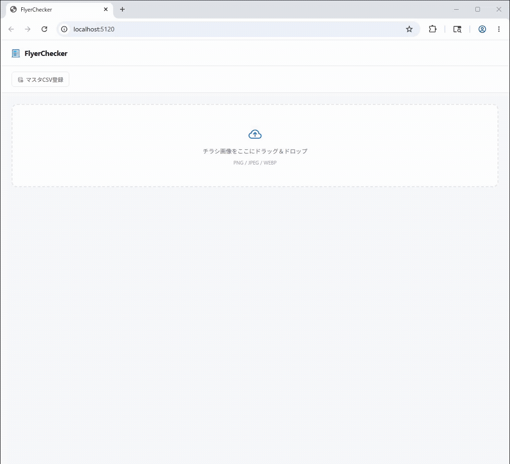

# FlyerChecker

チラシ画像と商品マスタを比較して、広告価格の差異をチェックするBlazor Serverアプリケーション。



## アーキテクチャ

```
チラシ画像 (ブラウザD&D)
    ↓
Microsoft Foundry - 商品名・価格を JSON 抽出
    ↓
Azure AI Search - 商品名でベクトル類似検索
    ↓
Microsoft Foundry - マスタ候補と照合・価格差を判定
    ↓
結果を画面に表示
```

## 必要な環境

### Azure リソース

1. **Microsoft Foundry リソース** (`*.services.ai.azure.com` のエンドポイント) 
   - チャットモデルのデプロイ (例: `gpt-5.4-mini`、画像入力対応のもの) 
   - 埋め込みモデルのデプロイ (例: `text-embedding-3-small`、1536 次元) 
2. **Azure AI Search サービス** (Free プラン可) 
3. 認証
   - API キー認証

## 設定

### appsettings.json の構造

```json
{
  "Foundry": {
    "Endpoint": "https://YOUR-FOUNDRY-RESOURCE-NAME.services.ai.azure.com",
    "ApiKey": "",
    "ChatDeployment": "gpt-5.4-mini",
    "EmbeddingDeployment": "text-embedding-3-small",
    "EmbeddingDimensions": 1536
  },
  "AzureAISearch": {
    "Endpoint": "https://YOUR-SEARCH-RESOURCE.search.windows.net",
    "ApiKey": "",
    "IndexName": "flyer-products"
  }
}
```

## マスタ CSV のフォーマット

UTF-8、ヘッダ付きの CSV。`Id` は省略可 (省略時は自動採番) 。

```csv
Id,Name,Price,Category
P0001,コカ・コーラ 500ml,150,飲料
P0002,ポテトチップス うすしお 60g,128,スナック
```

## 使い方

### 1. アプリケーションの起動

```pwsh
cd FlyerChecker
dotnet run
```

ブラウザで `http://localhost:5120` を開きます。

### 2. マスタデータの投入

画面上部の「マスタCSV登録」ボタンをクリックして CSV ファイルを選択します。  
初回は Azure AI Search のインデックスが自動作成されます。

### 3. チラシ画像のチェック

チラシ画像 (PNG / JPEG / WEBP) をドラッグ＆ドロップするか、ドロップゾーンをクリックして選択します。  
処理が開始され、商品ごとの結果が順次表示されます。

## 結果の見方

| 列 | 説明 |
|----|------|
| チラシ商品名 | チラシ画像から抽出した商品名 |
| チラシ価格 | チラシ画像から抽出した価格 |
| マスタ商品名 | AI Search で最も一致した商品名 |
| マスタ価格 | マスタの正式価格 |
| 差額 | ✅ 一致 / ❌ チラシが高い / ⚠️ チラシが安い |
| コメント | LLM による判定コメント |
