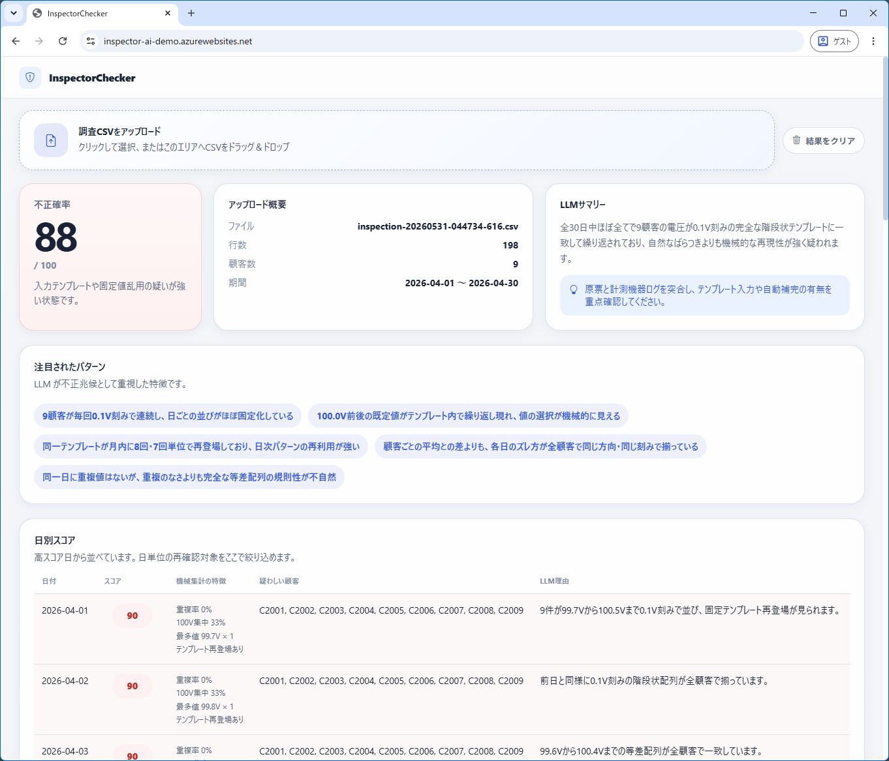

# InspectorChecker

電気の調査員が、実際には顧客を訪問せずに漏れ電流の調査値を入力していないかを、巡回調査の CSV から判定する Blazor Server アプリケーションです。漏れ電流の合格基準は **1mA 未満** で、1mA 直下の既定値（0.97mA 付近）への張り付きなどを不正シグナルとして検出します。



## アーキテクチャ

```text
巡回調査CSV（漏れ電流 mA）
    ↓
CSVローダーで行を読み込み
    ↓
電流値の分布 / 日別の重複率 / 既定値(0.97mA)集中率 / 日内ばらつき / テンプレート再利用を集計
    ↓
Microsoft Foundry (gpt-5.4-mini) に要約 + 生データを送信
    ↓
不正確率 / 日別スコア / 注目パターンを JSON で取得
    ↓
Blazor 画面で表示
```

## できること

- 調査員1名分の巡回調査結果 CSV を画面からアップロード
- 漏れ電流の値分布と日別の集中度を事前集計
- Microsoft Foundry の LLM に、集計結果と生データを渡して不正確率を 0〜100 で判定
- 日単位のスコア、疑わしい顧客 ID、注目パターンを画面に表示
- 正常 2 パターン / 不正 2 パターンのサンプル CSV を同梱

## 判定の前提

- 各調査日は別々の顧客を巡回して漏れ電流を測定する（巡回型）。
- 合格基準は漏れ電流 1mA 未満。
- 漏れ電流は設備ごとに自然なばらつきがあるため、値が散らばること自体は正常。

## 想定する不正パターン

- 同じ日に複数顧客で同一の電流値が多発する（日内のばらつきが不自然に小さい）
- 0.97mA のような 1mA 直下の既定値が不自然に集中する
- 日ごとの値の並び（顧客ID非依存）が複数日で完全一致で再登場する
- 0.01mA 刻みの階段状パターンや、説明しづらい規則性がある

## サンプルデータ

画面からダウンロードできるサンプルは次の 4 つです。

- `normal-organic-variance.csv`
  - 設備ごとに漏れ電流が自然に散らばる正常データ
- `normal-route-weather-shift.csv`
  - 湿度などで全体水準が日々上下するが、日内のばらつきは残る正常データ
- `fraud-default-097-template.csv`
  - 1mA 直下の 0.97mA 前後を多用する不正データ
- `fraud-repeated-daily-template.csv`
  - 同じ電流値の並びを毎日使い回す（階段状テンプレート）不正データ

## CSV フォーマット

UTF-8、ヘッダ付きの CSV を想定します。

```csv
InvestigationDate,CustomerId,Current
2026-04-01,C2001,0.42
2026-04-01,C2002,0.18
```

`Current` は漏れ電流（mA、小数2桁）です。

## 画面の見方

- 不正確率
  - 調査員全体に対する LLM のスコア
- 日別スコア
  - 再確認が必要な日を上から並べて表示
- 機械集計の特徴
  - 重複率、0.97mA 集中率、日内SD、最多値、テンプレート再利用を表示
- 電流値の分布
  - 値ごとの件数・構成比と、既定値付近 / 基準超過の判定を表示
- 再利用された日次テンプレート
  - 完全一致の値の並びが複数日に出た場合に表示

## 補足

- 本アプリケーションはデモ用途です。判定ロジックは「入力値が特徴的なパターンを持つか」を説明しやすいように設計しています。
- 実運用に進める場合は、訪問予定、ルート順、端末時刻、GPS、測定器ログなどを追加すると精度を上げやすくなります。
- サンプル CSV は 2026 年 4 月の巡回 11 日分で、1 日 18 顧客（毎日別の顧客）、合計 198 レコードです。
