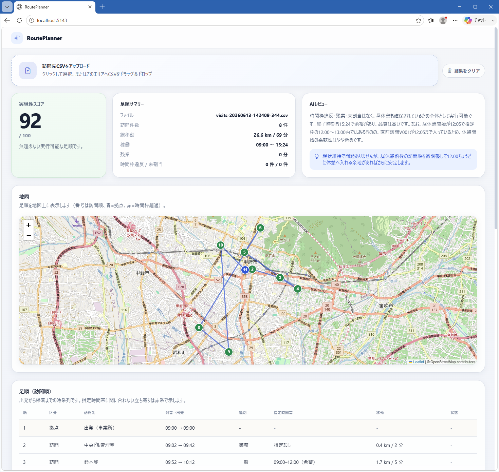

# RoutePlanner

電気設備点検の調査員が、その日の訪問先一覧から **1 日・調査員 1 名分の足順（訪問順）** を決める Blazor Server アプリケーションです。移動時間と指定時間帯を考慮した足順を**アルゴリズムで算出**し、その案を **Microsoft Foundry（LLM）でルール検証し、改善提案**を受け取るハイブリッド構成です。



詳細な設計は [Document/設計書.md](./docs/設計書.md) を参照してください。

## アーキテクチャ

```text
訪問先一覧CSV（その日の調査先）＋ 共通設定
    ↓
CSVローダーで VisitTarget に変換・検証
    ↓
2地点間の移動距離/時間を推定（Haversine × 道路迂回係数 ÷ 平均速度 × 天候係数）
    ↓
時間帯を考慮した最近傍法で足順を算出（昼休憩挿入・帰着・未割当判定）
    ↓
Microsoft Foundry (gpt-5.4-mini) に足順案を送信
    ↓
実現性スコア / ルール違反 / 改善提案を JSON で取得
    ↓
Blazor 画面で地図・足順テーブル・レビューを表示
```

## できること

- その日の訪問先一覧 CSV を画面からアップロード
- 移動時間・指定時間帯・勤務時間・昼休憩を考慮した足順を算出
- 出発から帰着までの到着/出発予定、移動量、残業、時間枠違反、未割当を表示
- 足順を地図（Leaflet ＋ OpenStreetMap）に番号付きで表示
- Microsoft Foundry の LLM による足順レビュー（実現性スコア 0〜100・違反・改善提案・注意メモ）
- 難易度の異なる甲府市のサンプル CSV を 3 種同梱

## 入力の考え方

インプットは 2 系統です（詳細は設計書 7 章）。

- **共通インプット（1 日・1 名単位）**: 事業所の住所/座標、勤務時間、昼休憩、移動手段（基本は車）、平均移動速度、道路迂回係数、天気予報と所要延長係数、種別ごとの平均調査時間、訪問間バッファ、最大訪問件数、残業可否、最適化方針 など。
- **訪問先ごとのインプット**: 訪問先 ID、住所、緯度経度、種別（一般/業務）、調査所要時間、指定時間帯（午前中・14:00-16:00 等）と厳守/希望、優先度、事前連絡要否、アクセス制約、危険注意 など。

## サンプルデータ

画面からダウンロードできるサンプルは次の 3 つです。すべて山梨県甲府市**中心部の狭い範囲（約 1.3km 四方）**の地点で、出発/帰着拠点は甲府市役所を既定とします。集合住宅（マンション・アパート）は**同一座標に複数住戸**を持ち、部屋番号は `CustomerName`（例: `甲府ハイツ 301`）、階は `AccessNote`（例: `3階／…`）、建物は `BuildingGroupId` で表します。1 件あたりの調査時間は戸別点検（検針）相当に短く設定しています。

- `kofu-dense-100.csv`
  - 狭域に集合住宅を中心とした約 100 件（午前約 50/午後約 50）。基本的な足順生成の確認用。
- `kofu-window-100.csv`
  - 狭域・約 100 件で午前中・14:00-16:00 等の厳守/希望の時間帯指定が多く、枠の取り合い・希望超過・未割当を検証。
- `kofu-tight-130.csv`
  - 狭域に集合住宅を多数含む約 130 件。1 日の処理能力を超え、未割当や残業が出やすい境界ケース。

> 同一建物（同一 `BuildingGroupId`）内の連続調査は移動・準備のバッファを要しないものとして扱い、集合住宅の住戸をまとめて回れるようにしています。

## CSV フォーマット

UTF-8、ヘッダ付きの CSV を想定します。任意列は空欄可（`ServiceMinutes` 空欄は種別ごとの既定値で補完）。時刻は `HH:mm`。

```csv
VisitId,CustomerName,Address,Latitude,Longitude,Category,ServiceMinutes,WindowStart,WindowEnd,WindowStrict,Priority,AppointmentRequired,WorkType,BuildingGroupId,AccessNote,HazardNote,ContactPhone
V012,甲府ハイツ 301,山梨県甲府市太田町5-1-18,35.6604,138.5663,一般,3,,,,中,false,検針,B-APT-01,3階／メーターは共用廊下,,
V013,甲府ハイツ 302,山梨県甲府市太田町5-1-18,35.6604,138.5663,一般,3,,,,中,false,検針,B-APT-01,3階／メーターは共用廊下,,
V099,中央ビル管理室,山梨県甲府市中央4-5-1,35.6620,138.5720,業務,40,,,,高,true,故障,,駐車場は地下P,,055-100-0003
```

> 集合住宅は同一の `Latitude`/`Longitude` と `BuildingGroupId` を共有し、部屋番号を `CustomerName`、階を `AccessNote` に記述します。

座標は地図 API に依存しないための直接入力です（住所のジオコーディングは将来拡張）。

## 画面の見方

- 実現性スコア
  - 足順全体の実行可能性・品質に対する LLM のスコア（0〜100、高いほど良い）
- 足順サマリー
  - 訪問件数・総移動・稼働時間・残業・時間枠違反/未割当
- 地図
  - 足順を OpenStreetMap 上に番号付きで表示（青=拠点、赤=時間枠超過、緑=通常）
- 足順（訪問順）
  - 出発から帰着までの時系列。指定時間帯に間に合わない立ち寄りは赤系で強調
- ルール違反 / 改善提案
  - AI が検出した問題と、並べ替え・前倒し・事前連絡などの具体的な改善
- 注意メモ / 未割当
  - 天候・アクセスの留意点、当日に組み込めなかった訪問先

## 補足

- 本アプリケーションはデモ用途です。足順はアルゴリズム（時間帯を考慮した最近傍法）で算出し、AI はルール検証と改善提案に用いるハイブリッド構成です。
- 移動時間は直線距離（Haversine）＋道路迂回係数による近似です。実運用では実地図の経路/所要 API への差し替えを想定し、算出処理を `TravelTimeMatrixBuilder` に分離しています。
- 足順最適化は最近傍法ベースで、2-opt / Or-opt による改善はコード上の TODO として残しています。
- 地図表示は Leaflet ＋ OpenStreetMap タイルを使用します（API キー不要、地図描画にはインターネット接続が必要）。
